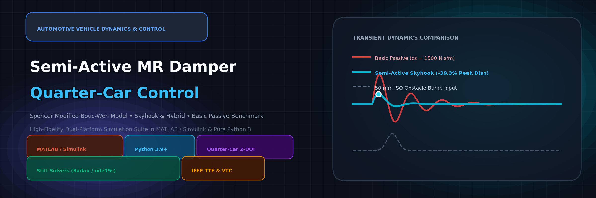
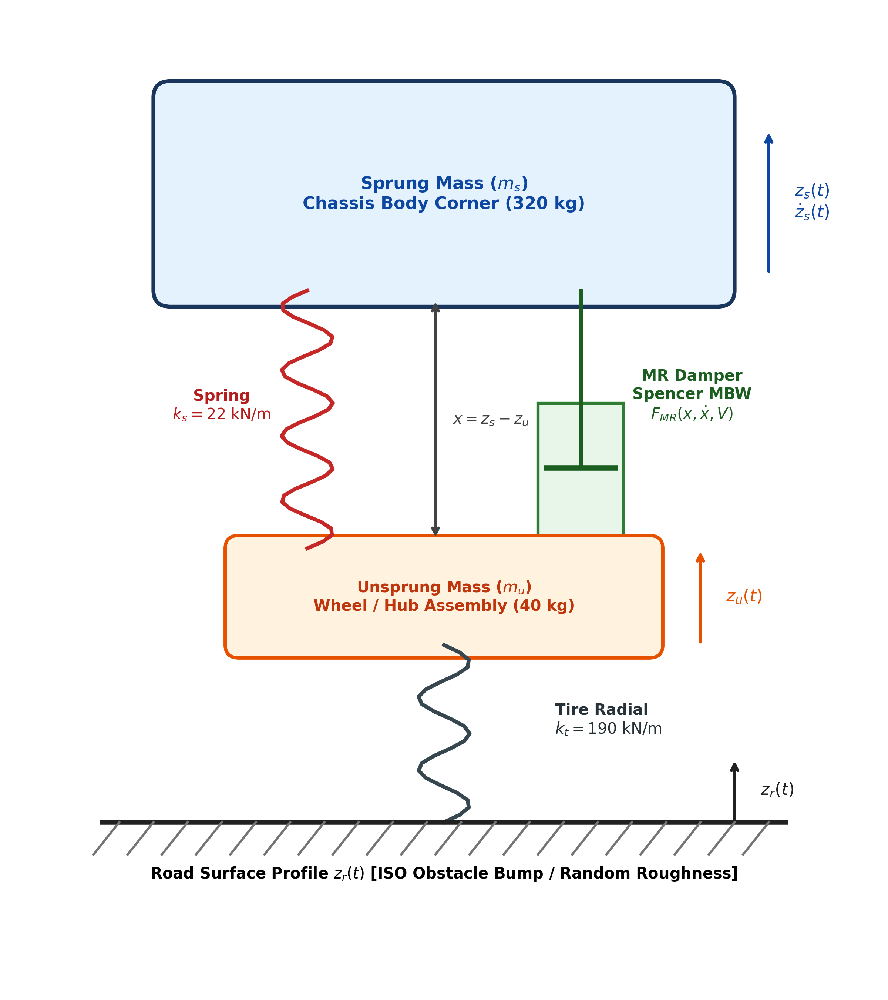
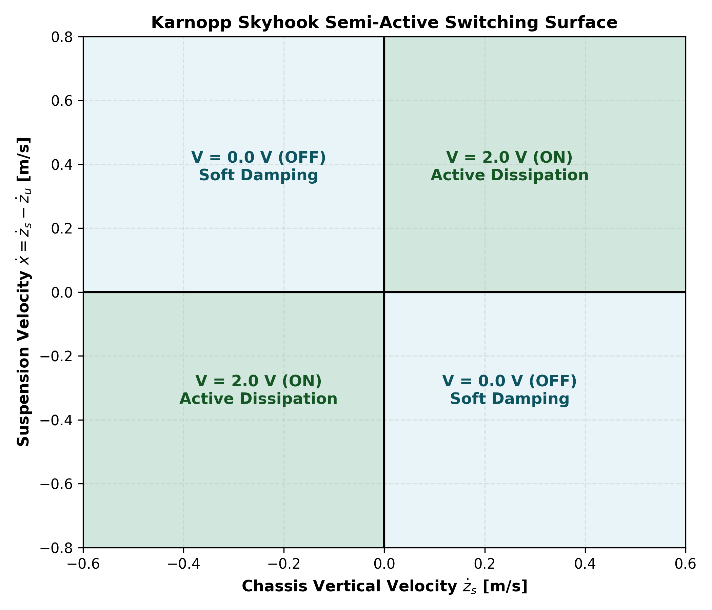
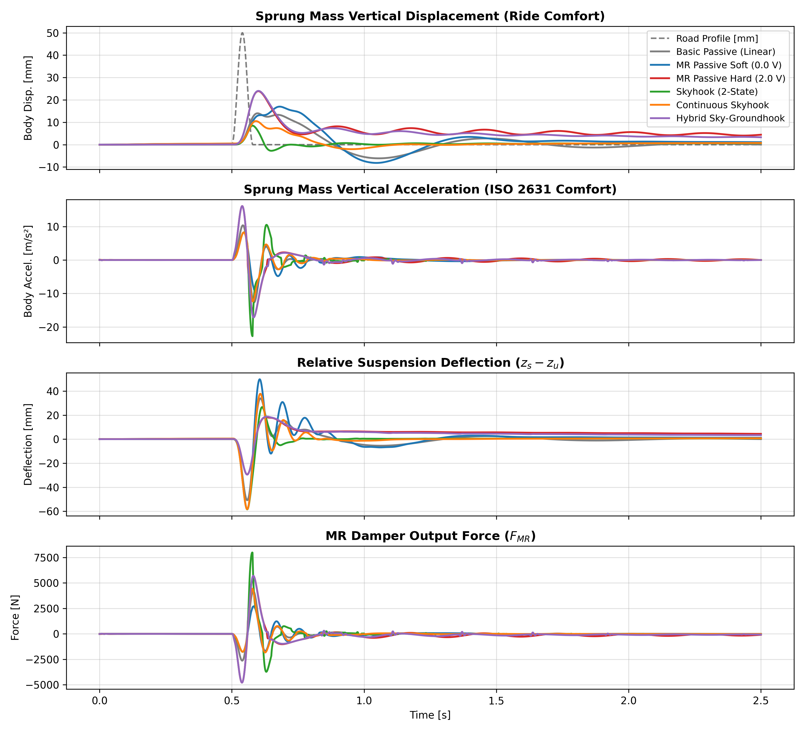
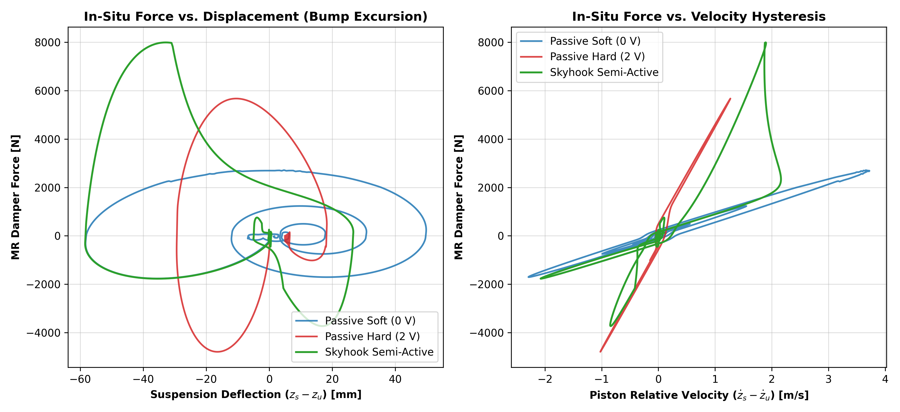
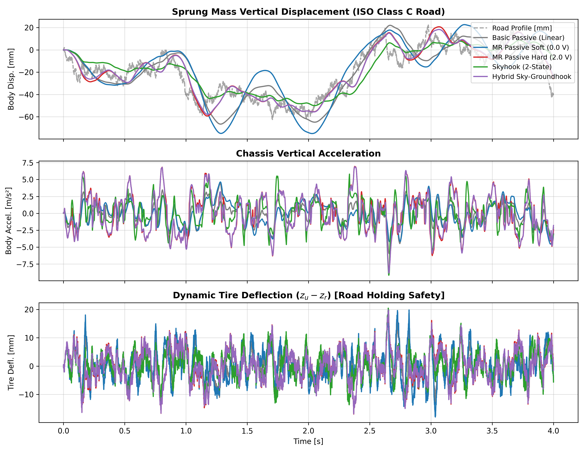

<p align="center">
  
</p>

<p align="center">
  <h1 align="center">🏎️ Semi-Active-MR-Damper-Control</h1>
  <p align="center"><b>Coupled 2-DOF Quarter-Car Vehicle Handling Dynamics & Spencer Modified Bouc-Wen MR Damper</b></p>
  <p align="center"><i>High-Fidelity Dual-Platform Simulation & Semi-Active Control Framework in MATLAB / Simulink & Pure Python 3</i></p>
</p>

<p align="center">
  <a href="https://opensource.org/licenses/MIT"></a>
  <a href="https://www.mathworks.com/products/matlab.html"></a>
  <a href="https://www.mathworks.com/products/simulink.html"></a>
  <a href="https://www.python.org/"></a>
  <a href="https://doi.org/10.1109/TTE.2025.3535765"></a>
  <a href="https://github.com/waqasmbaig/Semi-Active-MR-Damper-Control"></a>
</p>

<p align="center">
  <a href="#-key-features"><b>Key Features</b></a> •
  <a href="#-mechanical-architecture"><b>Architecture</b></a> •
  <a href="#-governing-mathematics"><b>Mathematics</b></a> •
  <a href="#-model-parameters"><b>Parameters</b></a> •
  <a href="#-simulink-model-organization"><b>Simulink Model</b></a> •
  <a href="#-python-package-architecture"><b>Python Package</b></a> •
  <a href="#-benchmark-case-studies"><b>Benchmarks</b></a> •
  <a href="#-quick-start"><b>Quick Start</b></a> •
  <a href="#-citation-request"><b>Citations</b></a>
</p>

---

> [!TIP]
> **🔗 MR Damper Companion Ecosystem**:
> - **[Semi-Active-MR-Damper-Control](https://github.com/waqasmbaig/Semi-Active-MR-Damper-Control)**: 2-DOF Quarter-Car vehicle dynamics benchmark, Skyhook / Groundhook / Hybrid semi-active control, and Basic Linear Passive Damper comparison in Python & Simulink.
> - **[MRD-Modified-Bouc-Wen-Model](https://github.com/waqasmbaig/MRD-Modified-Bouc-Wen-Model)**: Core experimental MR damper phenomenological model & dyno hysteresis characterization.
> - **[Modified-Bouc-Wen-Model-Simulation](https://github.com/waqasmbaig/Modified-Bouc-Wen-Model-Simulation)**: Interactive in-browser web application hosted on Google AI Studio.
> - **[MR-Damper-Lab](https://github.com/waqasmbaig/MR-Damper-Lab)**: Digital twin lab tutorials and telemetry analysis toolkit.

> [!NOTE]
> **🏷️ Repository Tags & Topics**: `Quarter car`, `quarter-car`, `quarter-car-model`, `semi-active-control`, `semi-active-mr-damper-control`, `mr-damper`, `magnetorheological-damper`, `skyhook-control`, `groundhook-control`, `bouc-wen-model`, `vehicle-dynamics`, `vibration-control`, `simulink`, `matlab`, `python`.

---

## 🌟 Key Features

<table>
  <tr>
    <td width="50%">
      <h3>⚡ Dual-Platform Framework</h3>
      <p>Seamless execution across <b>MATLAB / Simulink</b> (<code>Quarter_Car_MRD.slx</code>) and standalone <b>Pure Python 3</b> (<code>quarter_car</code> package) with stiff ODE integrators (SciPy Radau and deterministic fixed-step RK4).</p>
    </td>
    <td width="50%">
      <h3>🧲 High-Fidelity Spencer MR Damper</h3>
      <p>Couples the 14-parameter <b>Spencer Modified Bouc-Wen (MBW)</b> phenomenological damper model with nitrogen gas accumulator compliance ($k_1, c_1, x_0$) and continuous electromagnetic coil delay ($\tau \approx 5.26\text{ ms}$).</p>
    </td>
  </tr>
  <tr>
    <td width="50%">
      <h3>🕹️ Advanced Semi-Active Controllers</h3>
      <p>Includes modular implementations of <b>Passive Soft</b> ($0.0\text{ V}$), <b>Passive Hard</b> ($2.0\text{ V}$), <b>Karnopp 2-State Skyhook</b>, <b>Continuous Linear Skyhook</b>, and <b>Hybrid Skyhook-Groundhook</b> control.</p>
    </td>
    <td width="50%">
      <h3>🛣️ Standard ISO Road Excitations</h3>
      <p>Integrated road profiles conforming to international standards: <b>ISO Discrete Obstacle Bump</b> (50 mm Haversine), <b>ISO 8608 Stochastic Road Roughness</b> (Class A&ndash;E), swept-sine harmonic chirps, and step curb strikes.</p>
    </td>
  </tr>
</table>

---

## 📐 Mechanical Architecture

The complete system couples the 2-Degree-of-Freedom vehicle chassis corner with the internal kinematics of the Spencer Modified Bouc-Wen MR damper:

<p align="center">
  
</p>

### Mechanical Components:
- **Sprung Mass ($m_s = 320\text{ kg}$)**: Represents quarter vehicle chassis body mass (bounce mode natural frequency $f_{n,s} \approx 1.32\text{ Hz}$).
- **Unsprung Mass ($m_u = 40\text{ kg}$)**: Wheel hub, brake assembly, and tire mass (wheel-hop mode natural frequency $f_{n,u} \approx 11.6\text{ Hz}$).
- **Suspension Spring ($k_s = 22\text{ kN/m}$)**: Primary coil spring carrying static vehicle weight.
- **MR Damper ($F_{MR}$)**: Controllable magnetorheological dashpot delivering force $F_{MR}(x, \dot{x}, V)$.
- **Tire Radial Compliance ($k_t = 190\text{ kN/m}$)**: Pneumatic tire vertical radial stiffness.
- **Road Elevation ($z_r$)**: Ground vertical surface profile.

---

## 🔬 Governing Mathematics

All equations adhere strictly to **SI Base Units** ($\text{m}, \text{s}, \text{kg}, \text{N}, \text{V}, \text{rad}$) and **ISO 8855 coordinate conventions** (vertical axis $z$ positive upward):

### 1. Vehicle Corner Equations of Motion (2-DOF)
Applying Newton's second law to the sprung and unsprung masses:

$$\begin{aligned}
m_s \ddot{z}_s &= -k_s (z_s - z_u) - F_{MR} \\
m_u \ddot{z}_u &= k_s (z_s - z_u) + F_{MR} - k_t (z_u - z_r)
\end{aligned}$$

Defining relative suspension stroke $x = z_s - z_u$ (extension positive) and dynamic tire deflection $x_t = z_u - z_r$:

$$\begin{aligned}
\ddot{z}_s &= \frac{-k_s x - F_{MR}}{m_s} \\
\ddot{z}_u &= \frac{k_s x + F_{MR} - k_t x_t}{m_u}
\end{aligned}$$

### 2. Spencer Modified Bouc-Wen MR Damper Dynamics
The MR damper output force $F_{MR}$ transmitted to the chassis is:

$$F_{MR} = c_1 \dot{y} + k_1 (x - x_0)$$

Equilibrium across internal float plate $y$ yields the intermediate node velocity:

$$\dot{y} = \frac{1}{c_0 + c_1} \Big[ \alpha z + c_0 \dot{x} + k_0 (x - y) \Big]$$

The hysteretic restoring variable $z$ evolves according to the Bouc-Wen differential equation:

$$\dot{z} = A (\dot{x} - \dot{y}) - \beta (\dot{x} - \dot{y}) |z|^n - \gamma |\dot{x} - \dot{y}| |z|^{n-1} z$$

The coil electromagnetic lag filter governs effective voltage $u$:

$$\dot{u} = -\eta (u - V_{cmd})$$

with voltage-dependent parameters:

$$\alpha(u) = \alpha_a + \alpha_b u, \qquad c_0(u) = c_{0a} + c_{0b} u, \qquad c_1(u) = c_{1a} + c_{1b} u$$

### 3. Basic Linear Passive Shock Absorber ($F_{pass}$)
For conventional passenger vehicle suspensions without magnetorheological fluid, the damping force follows a standard linear viscous law:

$$F_{pass} = c_s (\dot{z}_s - \dot{z}_u) = c_s \dot{x}$$

with nominal linear damping coefficient $c_s = 1500.0\text{ N}\cdot\text{s/m}$, corresponding to a typical passenger car damping ratio of:

$$\zeta = \frac{c_s}{2\sqrt{m_s k_s}} = \frac{1500.0}{2\sqrt{320 \times 22000}} \approx 0.283$$

### 4. Semi-Active Skyhook Control Laws

<p align="center">
  
</p>

- **Classical Karnopp 2-State (On-Off) Skyhook**:
  $$V_{cmd} = \begin{cases} V_{\max} = 2.0\text{ V}, & \text{if } \dot{z}_s (\dot{z}_s - \dot{z}_u) \ge 0 \\ V_{\min} = 0.0\text{ V}, & \text{if } \dot{z}_s (\dot{z}_s - \dot{z}_u) < 0 \end{cases}$$

- **Continuous Linear Skyhook**:
  $$V_{cmd} = \begin{cases} \text{clip}\left(V_{\min} + \frac{C_{sky} |\dot{z}_s|}{F_{ref}} (V_{\max} - V_{\min}), V_{\min}, V_{\max}\right), & \text{if } \dot{z}_s (\dot{z}_s - \dot{z}_u) \ge 0 \\ V_{\min}, & \text{otherwise} \end{cases}$$

- **Hybrid Skyhook-Groundhook**:
  $$\sigma_{hybrid} = \alpha_{hyb} \dot{z}_s - (1 - \alpha_{hyb}) \dot{z}_u$$
  $$V_{cmd} = \begin{cases} V_{\max}, & \text{if } \sigma_{hybrid} (\dot{z}_s - \dot{z}_u) \ge 0 \\ V_{\min}, & \text{otherwise} \end{cases}$$

---

## 📊 Model Parameters

| Parameter | Symbol | Value | SI Unit | Description |
| :--- | :---: | :---: | :---: | :--- |
| **Sprung Mass** | $m_s$ | `320.0` | $\text{kg}$ | Quarter chassis corner mass |
| **Unsprung Mass** | $m_u$ | `40.0` | $\text{kg}$ | Wheel, tire, and hub mass |
| **Suspension Spring** | $k_s$ | `22000.0` | $\text{N/m}$ | Primary coil spring stiffness |
| **Tire Vertical Stiffness** | $k_t$ | `190000.0` | $\text{N/m}$ | Radial tire vertical stiffness |
| **Basic Passive Damping** | $c_s$ | `1500.0` | $\text{N}\cdot\text{s/m}$ | Linear passive shock absorber ($\zeta \approx 0.28$) |
| **Zero-field damping** | $c_{0a}$ | `784.0` | $\text{N}\cdot\text{s/m}$ | Zero-voltage dashpot damping |
| **Field damping gain** | $c_{0b}$ | `1803.0` | $\text{N}\cdot\text{s/(m}\cdot\text{V)}$ | Damping sensitivity per volt |
| **Dashpot stiffness** | $k_0$ | `3610.0` | $\text{N/m}$ | Post-yield mechanical stiffness |
| **Accumulator damping** | $c_{1a}$ | `14649.0` | $\text{N}\cdot\text{s/m}$ | Nitrogen reservoir damping |
| **Accumulator gain** | $c_{1b}$ | `34622.0` | $\text{N}\cdot\text{s/(m}\cdot\text{V)}$ | Reservoir field sensitivity |
| **Accumulator stiffness** | $k_1$ | `840.0` | $\text{N/m}$ | Gas accumulator compliance |
| **Accumulator offset** | $x_0$ | `0.0245` | $\text{m}$ | Static pre-charge stroke offset ($24.5\text{ mm}$) |
| **Hysteresis scale** | $\alpha_a$ | `12441.0` | $\text{N/m}$ | Base hysteretic yield coefficient |
| **Hysteresis gain** | $\alpha_b$ | `38430.0` | $\text{N/(m}\cdot\text{V)}$ | Voltage hysteretic gain |
| **Shape parameter** | $\gamma$ | `136320.0` | $\text{m}^{-2}$ | Hysteresis loop orientation |
| **Shape parameter** | $\beta$ | `2059020.0` | $\text{m}^{-2}$ | Hysteresis loop width |
| **Restoring multiplier** | $A$ | `58.0` | $-$ | Elastic restoring multiplier |
| **Yield smoothness** | $n$ | `2.0` | $-$ | Transition order exponent |
| **Coil time constant** | $\eta$ | `190.0` | $\text{s}^{-1}$ | Coil rate ($\tau \approx 5.26\text{ ms}$) |

---

## 🎛️ Simulink Model Organization

The model [`matlab/Quarter_Car_MRD.slx`](matlab/Quarter_Car_MRD.slx) is architected into 5 modular, clean subsystems:

```
Quarter_Car_MRD.slx (Top Level)
├── Road_Excitation           [Selectable: Haversine Bump, Chirp, ISO Class C, Step]
│   └── Outputs: z_r, z_r_dot
├── Semi_Active_Controller    [Arbitrates Basic Passive, MR 0V/2V, Skyhook, Continuous, Hybrid]
│   └── Outputs: V_cmd
├── MR_Damper_Bouc_Wen        [Spencer MBW model & Linear Damper: du/dt, alpha, c0, c1, dy/dt, dz/dt]
│   └── Outputs: F_MR, u_eff
├── Quarter_Car_Dynamics      [2-DOF vehicle plant: ms, mu, ks, kt double integrators]
│   └── Outputs: z_s, z_s_dot, z_s_ddot, z_u, z_u_dot, x, x_dot, x_t
└── Performance_Scopes        [Scopes for ride comfort, accelerations, deflection, and force]
```

### Key MATLAB Scripts:
- **[`matlab/init_quarter_car_params.m`](matlab/init_quarter_car_params.m)**: Loads all vehicle, MR damper, basic passive damper ($c_s = 1500\text{ N}\cdot\text{s/m}$), road, controller, and solver settings into the base workspace.
- **[`matlab/run_quarter_car_simulation.m`](matlab/run_quarter_car_simulation.m)**: Automatically executes multi-controller sweeps across Basic Passive, MR Soft/Hard, and Skyhook in Simulink.
- **[`matlab/simulate_quarter_car.m`](matlab/simulate_quarter_car.m)**: Standalone pure MATLAB stiff ODE solver (`ode15s`) that runs with **zero Simulink license requirement**.
- **[`matlab/build_quarter_car_model.m`](matlab/build_quarter_car_model.m)**: Programmatic model builder script that rebuilds `Quarter_Car_MRD.slx` via MATLAB's Simulink API.

---

## 🐍 Python Package Architecture

The Python package is organized as a production-grade, object-oriented library under `quarter_car/`:

```
quarter_car/
├── __init__.py           # Package exports and version
├── parameters.py         # MRDamperParameters and QuarterCarParameters dataclasses
├── mr_damper.py          # SpencerModifiedBoucWenMRDamper class
├── vehicle.py            # QuarterCarModel (coupled 7-state equations of motion)
├── controllers.py        # BasicPassiveDamperController, Passive, Skyhook, Groundhook, Hybrid
├── road_profiles.py      # HaversineBumpRoad, ISO8608RandomRoad, ChirpHarmonicRoad, StepRoad
├── simulator.py          # QuarterCarSimulator (SciPy Radau/BDF and fixed-step RK4)
└── metrics.py            # ISO 2631 ride comfort & ISO 8855 road holding metrics
```

---

## 📈 Benchmark Case Studies

### 1. ISO Discrete Obstacle Bump ($50\text{ mm}$ height, $45\text{ km/h}$)

<p align="center">
  
</p>

#### Comprehensive Performance Comparison:

| Suspension Configuration | RMS Accel. [$\text{m/s}^2$] | Peak Body Disp. [$\text{mm}$] | Settling Time [$5\%$] | Peak Susp. Travel [$\text{mm}$] | Comparative Performance vs. Basic Passive |
| :--- | :---: | :---: | :---: | :---: | :--- |
| **Basic Passive Damper ($c_s = 1.5\text{ kN}\cdot\text{s/m}$)** | $1.66$ | $14.0$ | $2.01\text{ s}$ | $50.8$ | **Traditional Shock Absorber Baseline** |
| **MR Damper - Passive Soft ($0.0\text{ V}$)** | $1.41$ | $17.0$ | $1.53\text{ s}$ | $58.3$ | Underdamped chassis bounce ($+21.4\%$ peak disp) |
| **MR Damper - Passive Hard ($2.0\text{ V}$)** | $2.51$ | $23.9$ | $2.05\text{ s}$ | $29.4$ | Overdamped harshness ($+70.7\%$ peak disp) |
| **MR Damper - Continuous Skyhook** | **$1.53$** | **$10.5$** | **$1.45\text{ s}$** | $58.3$ | **$25.0\%$ displacement reduction**, $7.8\%$ lower accel |
| **MR Damper - Skyhook (2-State)** | **$2.17$** | **$8.5$** | **$1.36\text{ s}$** | $58.4$ | **$39.3\%$ Displacement Reduction**, **$32.3\%$ faster settling** |

### 2. In-Situ Hysteresis Loops During Vehicle Motion

<p align="center">
  
</p>

### 3. ISO 8608 Stochastic Road Roughness (Class C, $50\text{ km/h}$)

<p align="center">
  
</p>

---

## 🚀 Quick Start

### 1. Installation
```bash
git clone https://github.com/waqasmbaig/Semi-Active-MR-Damper-Control.git
cd Semi-Active-MR-Damper-Control
pip install -r requirements.txt
```

### 2. Run Python Benchmarks & Tests
```bash
# Execute ISO discrete obstacle bump benchmark
python examples/benchmark_iso_bump.py

# Execute stochastic ISO Class C random road benchmark
python examples/benchmark_random_road.py

# Run comprehensive test suite (13 unit & integration tests)
pytest tests/ -v
```

### 3. Python API Usage Example
```python
from quarter_car import (
    QuarterCarModel,
    HaversineBumpRoad,
    SkyhookController,
    QuarterCarSimulator
)

# 1. Instantiate 2-DOF vehicle plant & road bump
road = HaversineBumpRoad(height=0.05, length=1.0, velocity_kmh=45.0)
plant = QuarterCarModel()
sim = QuarterCarSimulator(vehicle_model=plant, road_profile=road)

# 2. Simulate 2-State Skyhook Semi-Active Controller
controller = SkyhookController(mode="two_state")
res = sim.simulate(controller, t_span=(0.0, 2.5), dt=2e-4, solver="rk4")

# 3. Print quantitative performance indicators
print(res.summary())
print(f"Peak Body Displacement: {res.metrics['peak_disp_mm']:.1f} mm")
print(f"RMS Chassis Accel:      {res.metrics['rms_accel_mps2']:.2f} m/s^2")
```

### 4. MATLAB & Simulink Execution
```matlab
% In MATLAB command window:
cd matlab/
run('init_quarter_car_params.m')          % Load workspace parameters

% Option A: Run organized Simulink model
open_system('Quarter_Car_MRD.slx')
run('run_quarter_car_simulation.m')        % Automated multi-controller sweep

% Option B: Standalone MATLAB simulation (Zero Simulink dependency)
run('simulate_quarter_car.m')
```

---

## 📖 Citation Request

If you use this quarter-car simulation framework, the Spencer Modified Bouc-Wen MR damper model, or code in your academic research, please cite:

```bibtex
@article{yu2025robust,
  author    = {Z. Yu and R. Luo and P. Wu and W. M. Baig and H. Ma and Z. Hou},
  title     = {Robust finite-frequency vibration control of in-wheel motor driving vehicles based on torque coordination and motor suspension},
  journal   = {IEEE Transactions on Transportation Electrification},
  year      = {2025},
  doi       = {10.1109/TTE.2025.3535765}
}

@inproceedings{baig2025adaptive,
  author    = {W. M. Baig and Z. Yu and H. Ma and Z. Hou},
  title     = {Adaptive vibration control of in-wheel motor drive vehicles with preview information},
  booktitle = {Proc. IEEE 101st Vehicular Technology Conference (VTC2025-Spring)},
  address   = {Oslo, Norway},
  year      = {2025},
  doi       = {10.1109/VTC2025-Spring65109.2025.11174543}
}

@inproceedings{baig2017fractional,
  author    = {W. M. Baig and Z. Hou and S. Ijaz},
  title     = {Fractional order controller design for a semi-active suspension system using Nelder-Mead optimization},
  booktitle = {Proc. 29th Chinese Control and Decision Conference (CCDC)},
  pages     = {2808--2813},
  year      = {2017}
}
```

---

## 📄 License
This repository is released under the **[MIT License](LICENSE)**. Copyright &copy; 2025 W. M. Baig.
